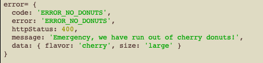

# Error messages

DATP provides a few useful functions for generating error messages
in multiple languages, and also allowing the DATP error messages to be
customized to match your application.

:::tip
If your application already uses an i18n or similar solution then you probably
don't need to read further. These libraries are optional - use them if you
feel they are beneficial, skip them if you don't.
:::

## Objectives

1. To take the error messages out of the code and put them in JSON files that are easy to translate.

2. Create libraries of errors for different subsystems. For example, one for DATP, one for you application, and one each for any subsystems you create.

3. Allow each user to have a preferred language. Error messages are displayed in that language if available, or else in the default language (i.e. English).


## In Use

When you start a DATP transaction you can specify a preferred language.
This will usually come from a user database, or whatever other method you
have for storing user credentials.
In this first example we call a transaction requesting English.


And we receive an English error message in our reply...


If we make the same request specifying Filipino as our preferred language...


...we get this reply...


(For any native Tagalog speakers, I apologise is the translation is wrong!)


## Error libraries

The language files can be either .json or .js files, and get registered at application startup.
In these files we specify the following:

- An application 'scope' that prevents name collisions with other error libraries.
- The language of the error library.
- A short description.

For each error we then define:

- A unique error code. It doesn't matter what this is - it just provides a
language independant code that can be easily quoted when errors are reported.
- An easy to remember name for the error, that can be used in the code when\
generating this error.
- An http status, for cases where the error is returned over http.
- The message in the specified language, optionally containing field replacements.

Here are a couple of snippets from errors-datp-EN.js and errors-datp-FIL.js.
Note that these could also be a JSON files if you remove the export statements.


Error libraries are registered in the code prior to starting your application server.

```javascript
import { generateErrorByName, registerErrorLibrary } from './lib/errorCodes'
import errors_datp_EN from './lib/errors-datp-EN'
import errors_datp_FIL from './lib/errors-datp-FIL'
...
// Register our DATP error codes
registerErrorLibrary(errors_datp_EN)
registerErrorLibrary(errors_datp_FIL)
...
// Start the server...
...
```

## Translating
Translations can be done by a non-technical person, bu editing the JSON error library files (instead of code). Just give them a copy of the default version of the file and ask them to replace the English with the new language, then register their new library
before server startup.

## Generating errors

Error messages are generated in application code using `DATP.generateErrorByName`.

```javascript
const { httpStatus, message } = DATP.generateErrorByName(
    'FIELD_IS_REQUIRED',
    { field: 'data' },
    preferredLanguage)
```

The `FIELD_IS_REQUIRED` is an application defined error name. You can create as
many error names as you wish - they are just treated as unique strings with
no particular meaning.


:::v-pre
Any number of data values can be provided, and are substituted into the error message
wherever the pattern {{fieldname}} is found in the message retreived from the error library.
:::

## During Development
We've included a feature that we've found streamlines development.

While a developer is concentrating on writing application code,
they can refer to errors that are not defined in the error library yet,
and put an example message that can be replaced later.

```javascript
const error = DATP.generateErrorByName('ERROR_NO_DONUTS',
    { flavor: 'cherry', size: 'large'},
    preferredLanguage,
    'Emergency, we have run out of {{flavor}} donuts!')

console.log(`error=`, error)
```

The optional last parameter, the "Emergency....donuts" message,
is used as the error message only until the error is properly added
to the error library. In the mean time the developer can concentrate
on writing and testing the application.

When it is initially used it will return the following error object, which
has the wrong error code and status, and possibly a wrong message, but
will suffice because the code is still under development.



At some stage these errors will need to be added to the error library.
To make sure that is not overlooked, and to make it easy, a code snippet
is written to the console every time it is run, until the
error is added to the error library.

> Error 'ERROR_NO_DONUTS' was not found in any of the error libraries.  
> Please edit the following JSON snippet and add it to your error library:  
>   
> {  
>     "code": "ERROR_NO_DONUTS",  
>     "name": "ERROR_NO_DONUTS",  
>     "httpStatus": "400",  
>     "message": "Emergency, we have run out of {{flavor}} donuts! - {{size}}",  
> }  

At a convenient time, we can cut and paste that snippet and any other errors from the
log file or javascript console and append them to our errors JSON file.

In the exampole below it has been added to the error library with updated details - given an error code and an httpStatus, and changed the error message to include the size of the donut.


It now generates the desired error message...


