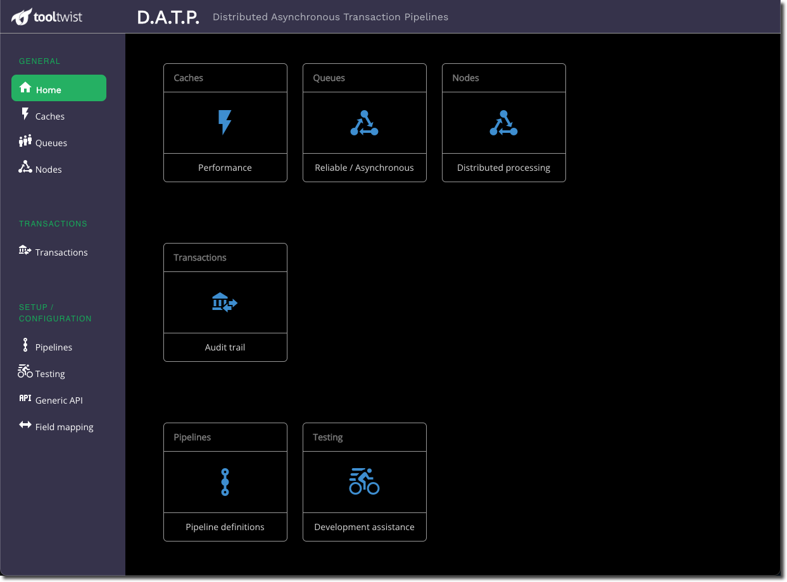

# Installation

While DATP can be installed and used many different ways, it is recommended to start by using the following instructions to set up
a development environment on your desktop or laptop.

This quick install uses Visual Studio Code and Docker to run up a
development environment in minutes, without the need to
install databases and other infrastructure on your development machine.

If you wish to install the database, REDIS or other components on
your machine later that can be done incrementally from this already
working configuration.

## Instructions for Developers
Version 4, October 2021

### Prerequisites
- A machine running Windows or OSX (Intel or M1)
- Docker Desktop
- Vscode + extensions (Remote Container + ESLint)
- Git Bash (on Windows)

You will also need your `username`/`password` to access the git repos.

### Step 1 - Download the code
In Terminal on Mac, or Git Bash on Windows:

A) Choose an install location that does not have any spaces in the path. For example `c:/Users/Fred Smith/xyz` will not work, but `c:/Users/FredSmith/xyz` or `c:/Projects/xyz` will work.

B) Don't use any existing AWS credentials

    $ export AWS_PROFILE=XYZ

C) Clone the project. You'll need to enter your username and password for the git repo on AWS.

Windows or Intel Mac:

    $ git clone https://git-codecommit.ap-southeast-1.amazonaws.com/v1/repos/datp-xpanse-dev

M1 Mac:

    $ git clone https://git-codecommit.ap-southeast-1.amazonaws.com/v1/repos/datp-xpanse-dev -b mac-m1

D) Load DATP and MONDAT

    $ cd datp-xpanse-dev
    $ sh ./0.sync-repositories

### Step 2 - Docker config
Go into Docker Desktop preferences, Resources->File Sharing, and add your installation directory created above (i.e. datp-xpanse-dev)

### Step 3 - Start Visual Studio Code

    $ code .

### Step 4 - Workspace inside Docker
Press “Reopen in Container” on the bottom right ... or Press the bottom left icon then “Reopen in Container” from the menu at the top.

The first time it runs it takes quite a while, as it builds the Docker container and then installs npm packages. If you want to watch what it's doing, you can show the log file.

### Step 5 - Load the database
Once you see _Configure Dev Container_ at the bottom, you can load the database. Either:

A) Use the option on the Terminal menu on the right.

B) Or, open a terminal inside vscode and run `./4.load-data`.

You can then access the database at [http://localhost:33360](), with usename root and no password.

### Step 6 - Start the servers
Once the startup completes (the _Configure Dev Container_ message usually disappears), start the DATP Master server and the Mondat server. This can be done three ways:

A) Press **Ctrl/Cmd + Shift + B**
  (This is the "Build" shortcut, and will open two terminal sessions for you).  Or,

B) Use the run-datp-server and run-mondat menu options on the Terminal menu on the right, or

C) Run `./5.run-master` and `./6.run-mondat` in a terminal inside vscode.

### Ready to use
Wait for these commands to complete. Mondat takes a while - it appears to be finished but is still loading until you see the second _Listening on: ..._ message.

Once this is complete, your application is running and ready for development work.

You will be able to use the application using the following URLs...

## URLs
### DATP healthcheck

[http://localhost:33370/datp/1.0/healthcheck]()

### Mondat

[http://localhost:33380/mondat]()

### PHPMyadmin

[http://localhost:33360/]()

<!-- 
## Release Notes

Latest version: 
ZZZZZZ
Detailed release notes for each version are available on [GitHub](https://github.com/vuejs/vue-next/blob/master/CHANGELOG.md). -->
