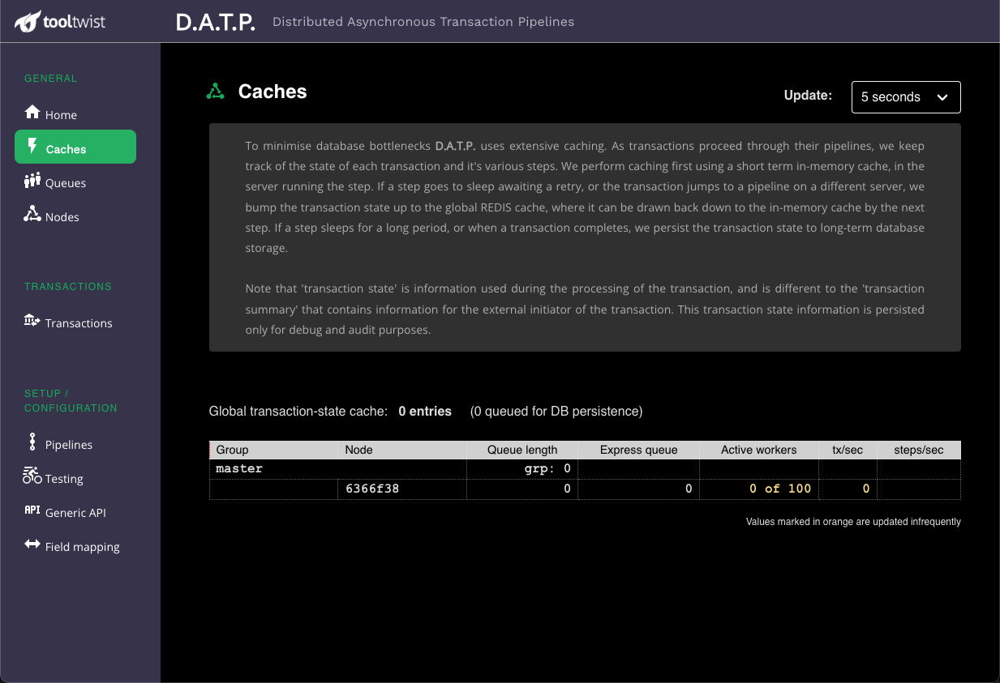

# Caches

<!--
::: tip NOTE
Already know Vue 2 and just want to learn about what's new in Vue 3? Check out the [Migration Guide](/guide/migration/introduction.html)!
:::
-->

The Caches page is used to view details of information currently cached in REDIS.

REDIS saves information with a TTL (Time To Live), meaning that they disappear from the cache after the allotted
period of time. This page can be used to watch cache levels to ensure they do not become excessive.

Note, that this page is rarely used, except in high volume environments.

