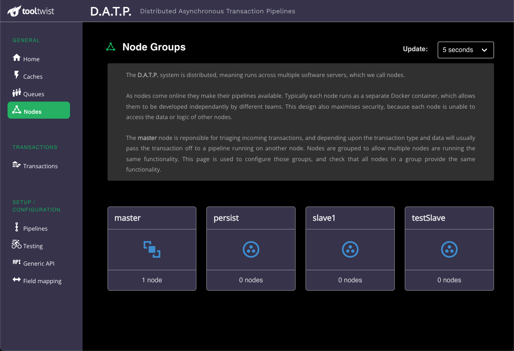

# Nodes

<!--
::: tip NOTE
Already know Vue 2 and just want to learn about what's new in Vue 3? Check out the [Migration Guide](/guide/migration/introduction.html)!
:::
-->

This page provides an overview of the configuration of node groups.

In a properly functioning system it contains similar information to the _Queues_ page, however the
queues page only shows nodes with active queues.

If you click on a node group you will see a page that provides further information about the node.

## Pipelines
Each transaction type (pipeline) is defined to run on a specific node group.
This page shows the transaction types that will run on this node group.

## Step Types
When a node starts, your custom software registers each of the step types supported by the node.
This page shows the step types coded into this node group, that may be used by the node group's pipelines.

::: tip
If you are a developer, this screen is useful to check you haven't missed anything.
As soon as you create a new step type and add it's registration code, it should appear here.
You can then define a pipeline using your new step on the [pipelines page](/guide/DZDmondat-pipelines.html).
You can confirm you've defined the pipeline properly by checking it also appears on this page.
:::