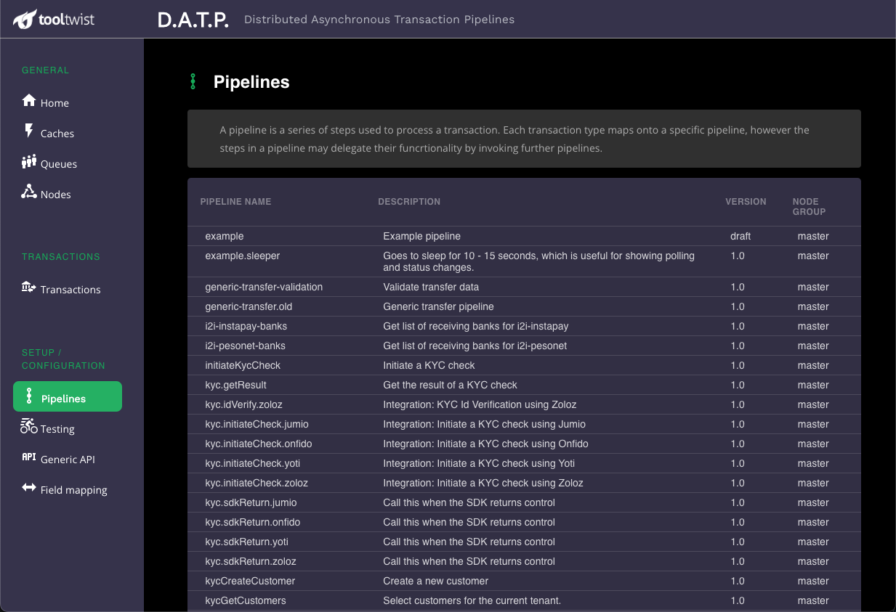
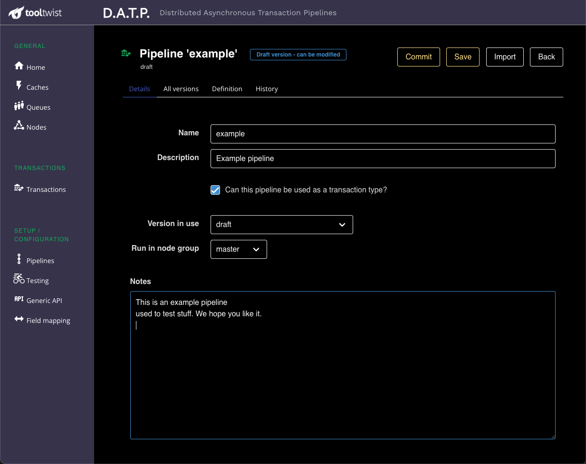
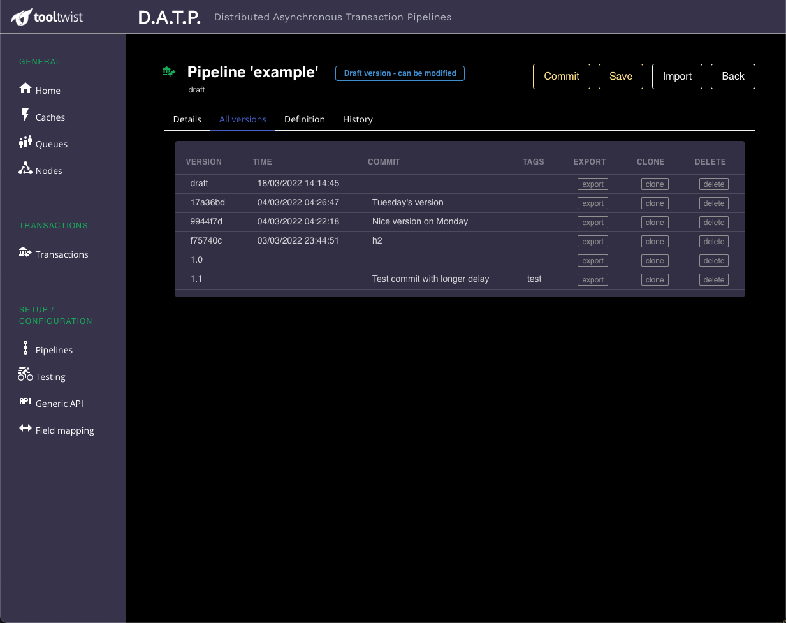
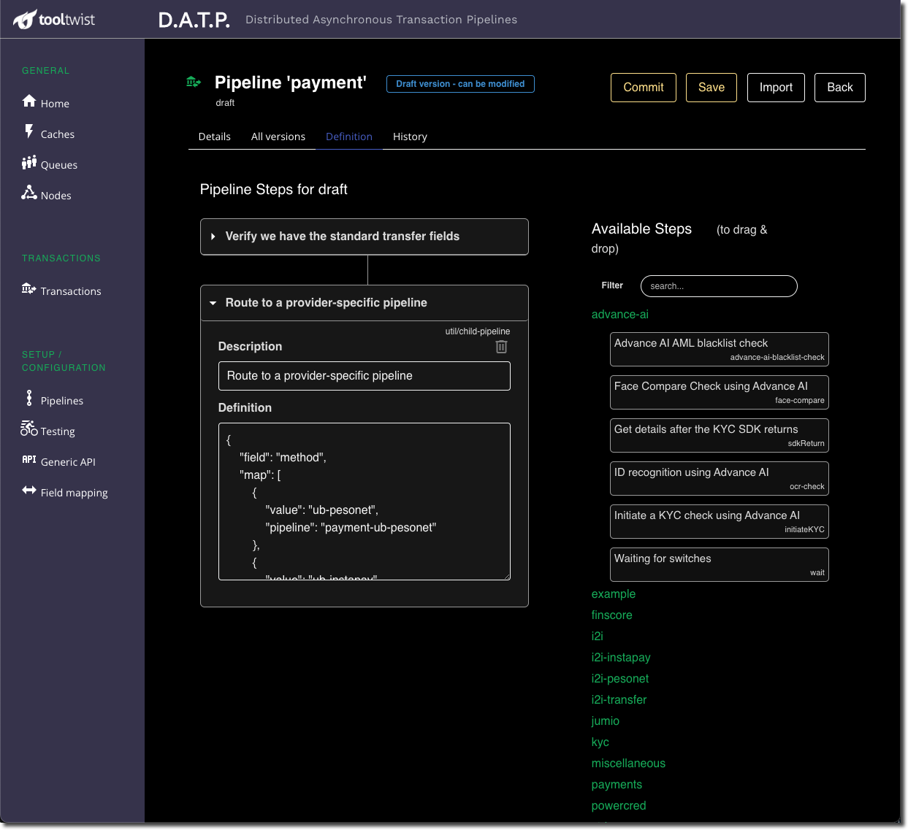
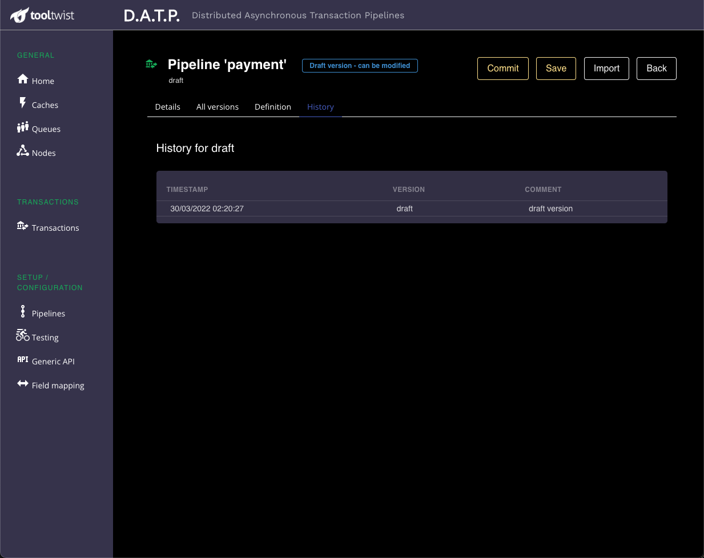

# Pipelines

<!--
::: tip NOTE
Already know Vue 2 and just want to learn about what's new in Vue 3? Check out the [Migration Guide](/guide/migration/introduction.html)!
:::
-->

This page is used to view and define the pipelines of your application.

Clicking on a pipeline will take you to the pipeline details page.

## Details

This page is used to enter the basic information about the pipeline:

- **Name**  
  This is the name of the pipeline, or "transaction type", used to invoke it as a transaction.

- **Description**  
  Description shown on the pipeline list page.

- **Can this pipeline be used as a transaction type?**  
  Some pipelines server as back-end pipelines only, and cannot be called directly.
  For example, if you have an aggregator API that routes requests to multiple
  backend systems, it's common to have a single front-end pipeline that validates the
  request, that passes the request back to a child pipeline that interfaces with the specific backend system.
  In this case you would not want the child pipeline called directly as a transaction,
  bypassing the validations.
  
- **Version in Use**  
  This specified which pipeline definition is currently being used for transactions of this type.

- **Run in node group**  
  This is used for routing - transactions of this type will always be queued to run
  on a node in this node group. This can be used to distribute load across multiple
  servers, with more control than simply replication of a regular API server.

  By configuring the allocation of transaction types into different groups, and the number of nodes
  in each of those groups, and the number of workers in each of the nodes, it is possible
  to control the resources dedicated to each part of the application.

- **Notes**  
  Record details here that may be useful later by yourself or by administrators.

## Versions
Migrating Pipeline definitions from development through to production has important security
and reliability implications.
The logic of your application is a combination of several parts:

1. Regular **Application code**.
2. The DATP **Steps** you have developed.
3. **Pipelines** that assemble the Steps into workflows.

You make sure the source code that implements (1) and (2) goes through appropriate testing and approval processes,
and it is important that the same applies to the pipelines. It's great that it's easy to modify pipelines during development, but it would be completely acceptable if pipelines could be as easily updated in a production
environment.

To prevent this happening, and to allow tracking and verification of pipeline definitions,
the pipeline page allows pipelines to be exported and imported, and each pipeline is versioned
with a generated hash. If the pipeline definition is changed then the hash will change.

This allows a pipeline to be tested and approved by QA, exported, and the devlops team notified
of the specific hash (version) approved for production. The pipeline file can then be imported
and the production environment told to switch to the new version.

## Pipeline definition
The `Definition` tab allows you to view the definition for a specific version of the pipeline.
If the version is ***draft*** then you can also edit the pipeline definition.

Steps are added by dragging and dropping Steps from the categories on the right.

Individual steps can be configured by expanding the step and editing the details. The exact details
that can be entered will be defined by the specific step. If you are developing steps, you can
specify the configuration information you'll however as you wish.

## Pipeline History
When you have finished making changes and testing the draft version of a pipeline,
you will need to _commit_ the changes using the Commit button. At this time it will ask
you for a commit message describing your changes.

These commit messages accrue - if you later _clone_ this new version so it becomes a new
draft version, then the process of committing that draft version will add a further commit
message to the list. These commit messages follow the pipeline definition around through
exports and imports, and if modified will corrupt the tamper prevention provided by the hash.

