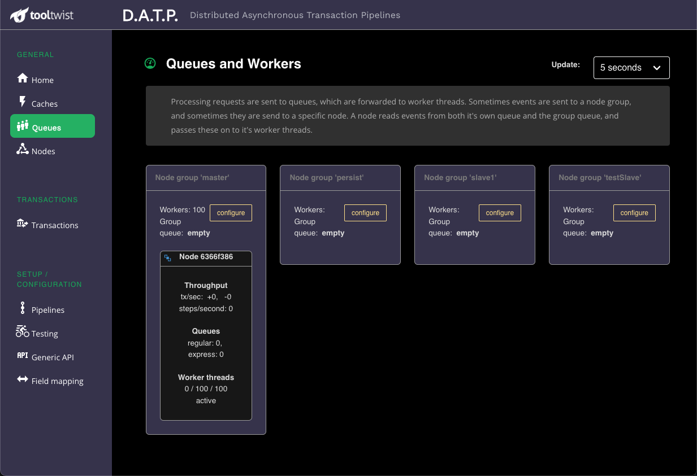
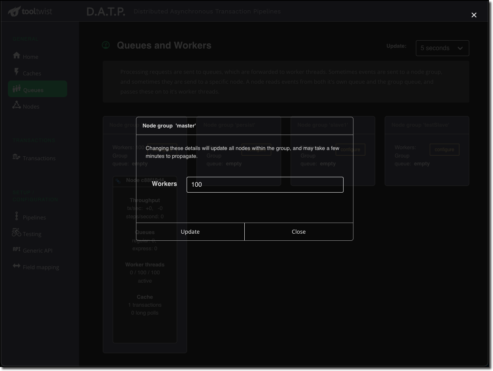

# Queues

<!--
::: tip NOTE
Already know Vue 2 and just want to learn about what's new in Vue 3? Check out the [Migration Guide](/guide/migration/introduction.html)!
:::
-->

This is the main page for performance monitoring. In production, or while load testing, you cannot
watch the number of transactions both in the queues, or currently being processed.
This page displays information in real time, with an update interval shown in the top right.

See [here](http://localhost:8080/guide/ZQueues.html#event-queues-2) for an explanation of queues and workers.

:::tip
Each node writes it's status to REDIS, and this page reads from REDIS
at the specified poll interval. For performance reasons however, the nodes 
report their status only periodically (configurable, but typically 15 seconds),
so the polling may take a short period to reflect the latest information.
:::

## Queues
Of particular interest are the queue sizes and the numbers of workers currently in use.
In a smooth flowing system the workers will keep up with the rate at which jobs are being
added to the queue, and the queueing will only be used to buffer surges in workload.

The throughput numbers show the number of transactions/steps being started each second,
and the number of transactions/steps being completed each second.
These numbers are typically balanced, although may mismatch when you have a burst of
long running transactions come in. In that case, workers will take a while to completed
the jobs, and then then will show up in the completed figure.

If queue lengths are getting long, it indicates that the work is coming in faster
than the node is processing. Keep a watch for inexplicably increasing queue lengths.

## Workers
The queues page shows three numbers for the worker threads:

1. The number of threads currently processing.
1. The maximum number of threads we will use for processing.
1. The total number of threads we have running.

> Worker threads use insignificant resources, so we don't shut them down if you don't want to use them.
> Hence item (3) shows the maximum number of workers you have had running.

The number of workers to be used can be adjusted using the `configure` button. The specified
number of workers will be applied to all nodes in the node group. Changes can take up to a
couple of minutes to propagate to the nodes and be reflected back in MONDAT.

:::tip
Not having enough workers is
likely to reduce throughput, because queue processing becomes [almost] single threaded.
Please note however that increasing the number of workers does not necessarity
equate to an increase in throughput. All thread runs are running in the same process
and sharing the same CPU and process resources.

This tuning is totally
application dependant, and is aff4ected by factors such as whether pipelines are CPU intensive,
or spend much of their time waiting for database resources or external systems.

***Please do thorough load testing*** -
DATP is highly tuneable, but unfortunately cannot magically tune itself
to your specific application design.
:::

If necessary the number of workers can be decreased to reduce workload on downstream systems.
It can also be reduced down to zero to completely stop the processing of transactions by the node group.
Instead, jobs will just wait in the queue until you start the workers again.

This may be useful to prevent continually attempting to contact a backend system you
know is not available. Just make sure you have the system configured sufficiently to
not overflow the REDIS caching. The caches page may be useful to monitor.

## Orphan nodes
If a node dies it may leave behind a queue of events that need to be processed.
In this case the orphan node will be displayed in red above all the other nodes in the group.

If you click on this orphan node you will be given a dialog box and the option to migrate
the events from the orphan queue into the queue for the node group. They will then be
processed by the first available node in the group.

