# Testing
The testing page allows a developer to quickly define and run tests on pipelines.
This provides a fast cycle time as you are coding, similar to tools such as [Postman](https://www.postman.com/)
but providing a simpler interface, and also features for polling and checking the result of a test.

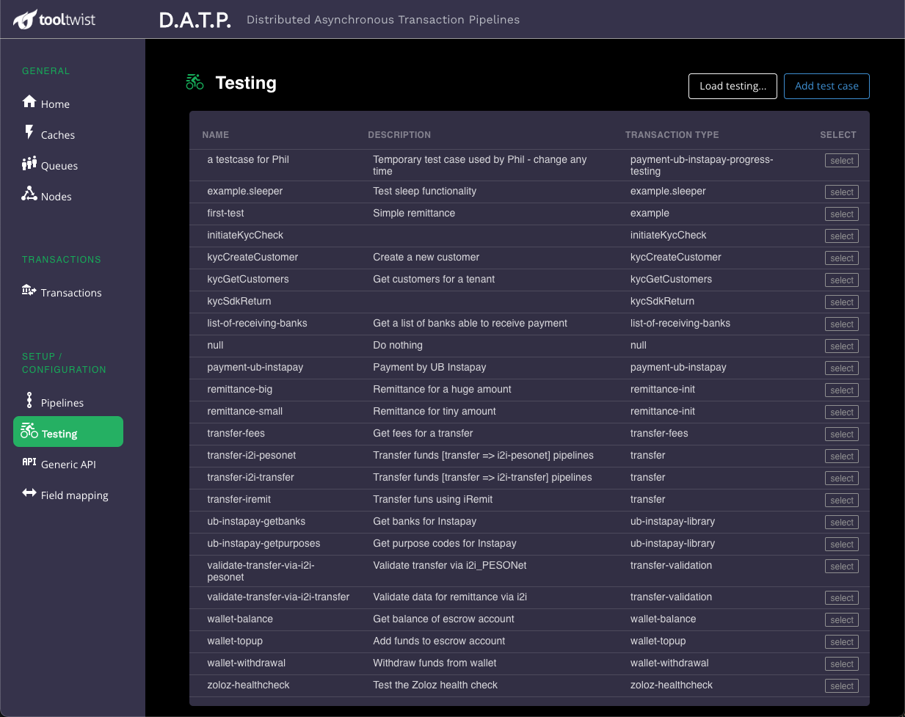

## Test definition
This tab provides information for the tests page, and also allows you to specify the pipeline being tested.

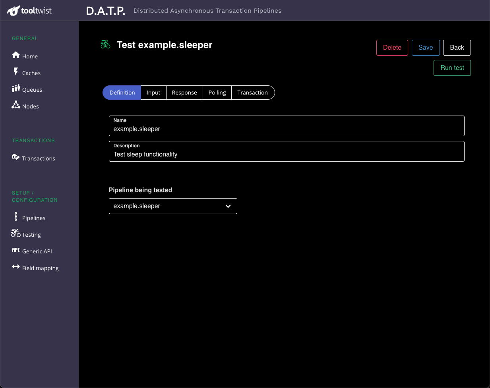

## Input tab
Once you've chosen which pipeline you are going to test, you need to specify what you are going to send to the pipeline. This data is in JSON format. The metadata corresponds to the format used to call the
transaction programatically, and the data is passed directly to the first step of the pipeline.

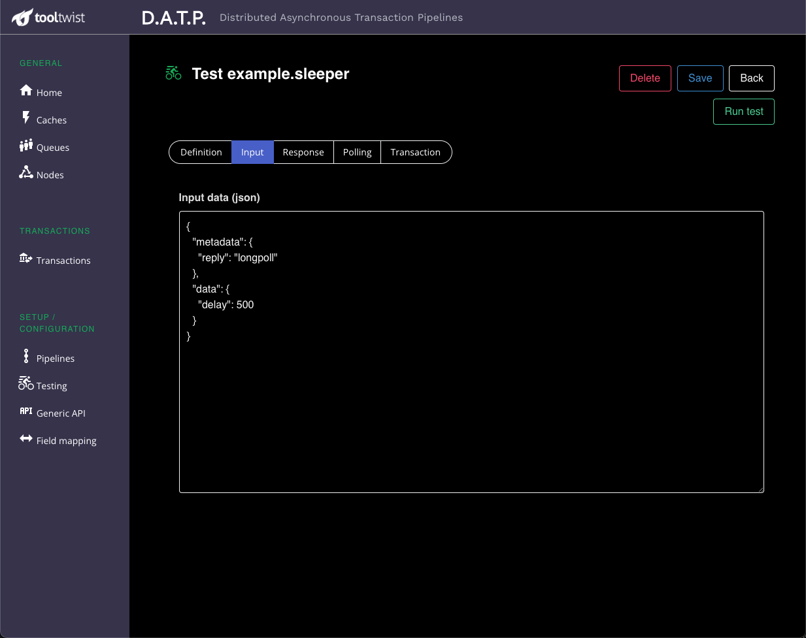

Pressing the `Run test` button will send this input to the pipeline.

## Response tab
Once the test is started, focus is moved to this tab, which will wait for the initial
reply from the API. If `metadata.reply` was `longpoll`, the server will wait for up to 15 seconds
for the transaction to complete, before replying.

If the transaction has completed, it's status will be shown on this page.
If the transaction has not completed, the reply will show a status of `running`,
and focus will shift to the next `Polling` tab.

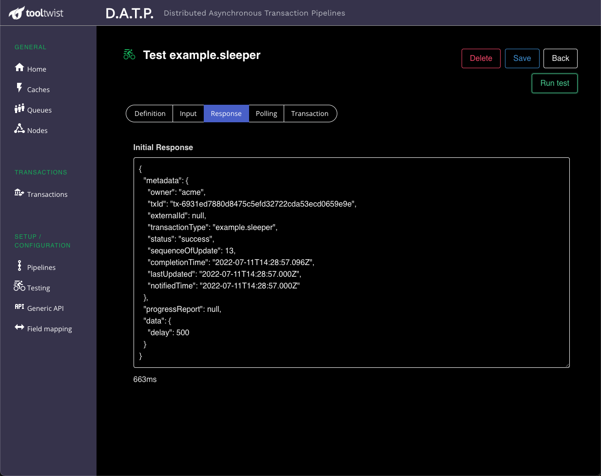

## Polling tab
If the initial API call to start the pipeline/transaction did not return
with the transaction complete, then this tab shows the output of each subsequent polling attempt,
ans will keep trying until the server returns a transaction status.

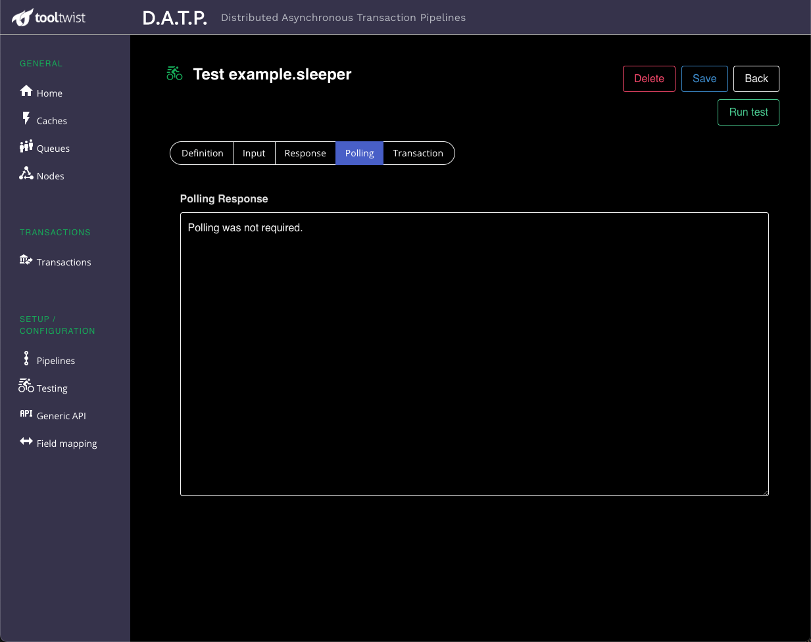

## Transaction tab
This tab shows an audit trail of the transaction, as it runs through it's pipeline, steps, and
any nested pipelines. By clicking on the transaction type, pipeline, or different steps, the information
on the right is displayed relevant to that part of the transaction processing.

### Log Entries
Log entries for this step - and only this step - are displayed here.
This is handy during development, and load testing, because the log entries are specific to this step,
and not intermixed with log messages from other transactions or parts of the application.

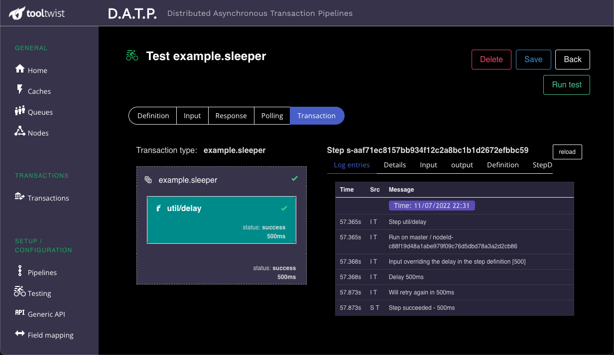

### Details
This shows a quick summary of the transaction, pipeline or step.
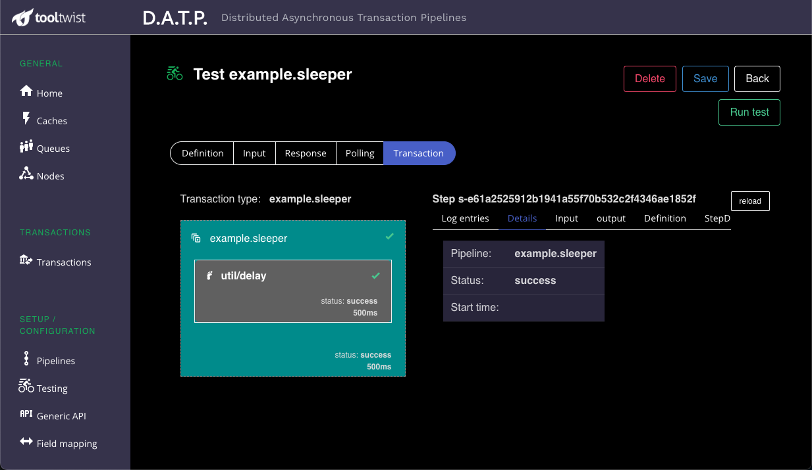

### Input
This shows the data that was passed in to the pipeline or step.
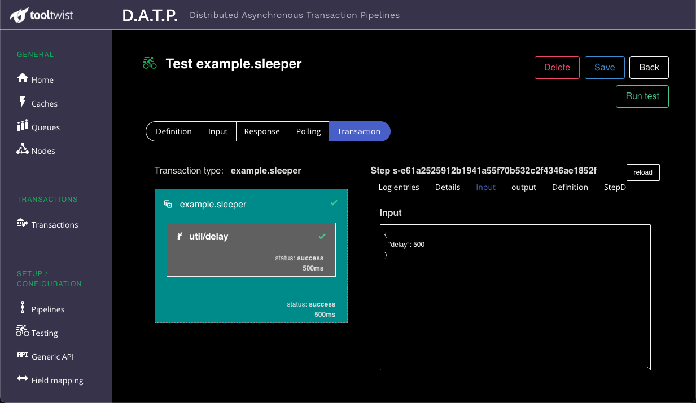

### Output
This shows the data that was passed out of the pipeline or step.
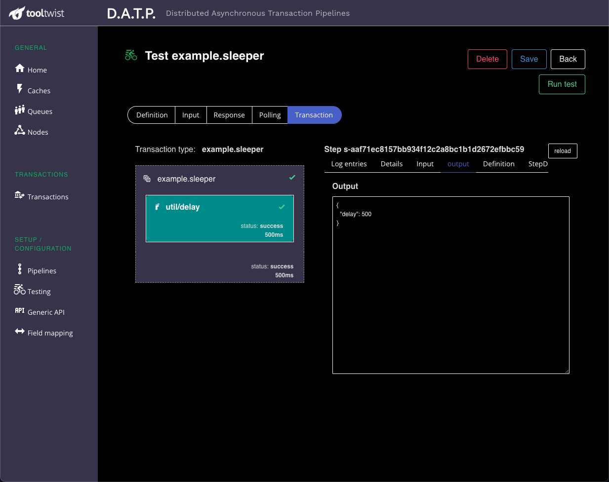

### Step definition
This shows the JSON configuration the pipeline or step - effectively the same information entered on the Pipeline defintion page. If the version of the pipeline has been changed, this will show the definition that was
actually used at the time the transaction ran.

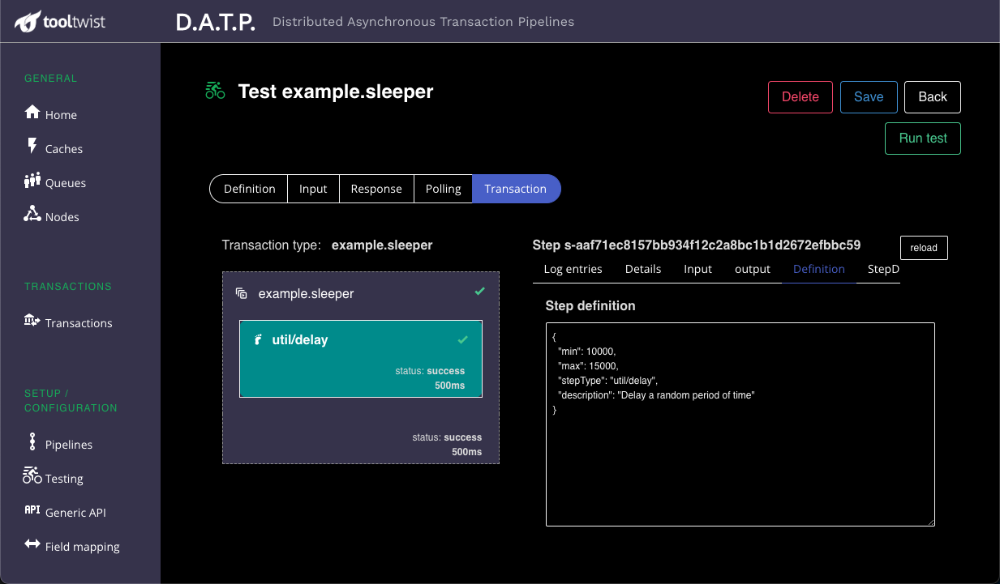

### Step Data
This is the internal transaction status data maintained by DATP as the transaction runs.
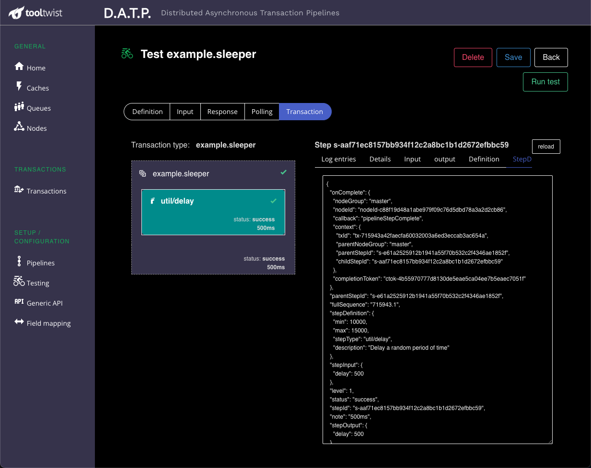

