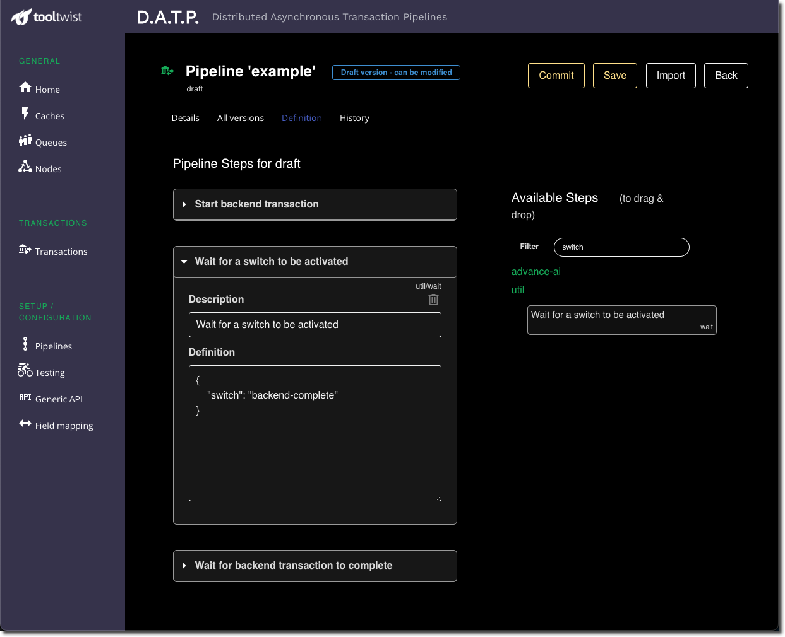

# Sleeping
Sometimes a transaction needs to wait until a certain time, or wait for an external event.

DATP allows a step to put itself to sleep using the `instance.retryLater` function.

The step can specify either a time duration, or a ***switch*** to wait for.

## Waiting for a duration
A step can put itself to sleep for any time period from seconds up to years.

```javascript
const sleepDuration = 60 // seconds
return await retryLater(null, sleepDuration)
```

With short durations up to a few seconds, DATP will put the worker thread to sleep using nodeJS's `setTimeout()` function. This allows fairly fine tuned control of the sleep duration, but when the worker is sleeping in this way it is not available to handle other requests.

For longer duration sleeps we don't want to take workers offline for extended periods or interfere with throughput,
so instead we record the required wakeup time and event that started the step, and schedule the step to be restarted with this same event later. At the appropriate time DATP's background task will take the event for the step and re-add it to the queue, where the step will be rerun using the first available worker thread.

## Waiting for a switch
Switches are user defined, and are simply a name given a true or false value.

```javascript
const nameOfSwitch = 'my-big-red-switch'
return await retryLater(nameOfSwitch)
```

The values of switches can be set either programatically, or using MONDAT.

A step can sleep awaiting a switch to be set in much the same way that long duration sleeps are handled.
The step and the event data that triggered it are saved, and DATP's background task will requeue the
event once the switch is set.

## Use case for switches
A typical use case might be when a step calls a backend API that run a transaction asynchronously
and returns it's status using a webhook. You can handle this 

In your step:  
> 1. Call the backend API to start the transaction.
> 1. Wait for switch X.
> (the step goes to sleep here)
> 1. Get the transaction status from the backend.
> 1. Do any other processing required, and return.

In your route that handles the webhook reply from the backend:
> 1. Set switch X

This simple approach allows long running steps to move themselves off to the side
for hours or days without consuming machine resources.

## Re-running events
Steps cannot actually stop and sleep midway through the step, then resume hours or days
later, because this would take the worker thread offline fdor anm extended period.
Instead, you code your steps to tell DATP "call me back later...".

When a step starts, it can determine how many times it has been retried, of if this is the first
time it has been run. As an example, here is pseudocode for the use case above...

```javascript
class MyStep extends Step {
    ...
    async invoke(instance) {

        // If this is the first time in, start the transaction
        const retry = await getRetryCounter()
        if (retry === 0) {
            [ Start the transaction on the backend ]
            ...
            const switchName = 'backend-complete'
            return await instance.retryLater(switchName)
        }

        // The switch must have been set
        [ Get the transaction status from the backend ]
        const backendStatus = ...
        const output = {
            ... backendStatus
        }
        return await instance.succeeded('Transaction completed', output)
    }

}
```

You will need to find a way for the webhook called by the backend to know which of our
transactions has been completed.


```javascript

const webhookOrPollingFunction() {
    ...
    const owner = ... // Application dependant - comes from yor credentials
    const transactionId = ...
    const switchName = 'backend-complete'
    await Transaction.setSwitch(OWNER, transactionId, switchName, true)
}
```

## Wait Step
Another approach that requires minimal coding, is to insert the `util/wait` step into a pipeline. This step will continue to sleep until the transaction switch is set. You will still need to provide the way the switch gets set, for example using code as above.



## Fault tolerance
For sleeps of more than a few seconds, and with switches, DAPT works across server and node failures. This means that you can safely use it to schedule future events, by having a pipeline that puts itself to sleep until the required time.

The transaction may have an incomplete status for an extended period of time, but
it places zero load upon the system.

