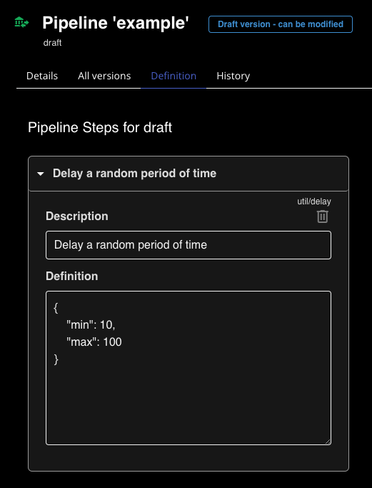
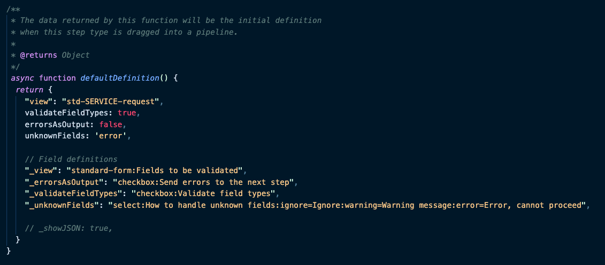
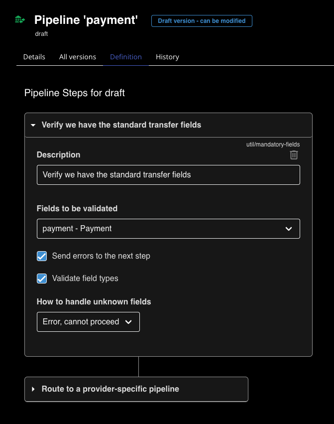

# Step definitions

## Parameters
As seen in the section on the MONDAT
[pipeline page](/guide/DZDmondat-pipelines.html#pipeline-definition),
a pipeline can allow the user to specify parameters to affect it's operation.
This allows steps to be reused in multiple pipelines with varying functionality.

The specific parameters recognised by the step is
at the discretion of the applicatin code.
The step might take no parameters, or it might have a long list of parameters.



##  Default values
The default parameter values for a step can be defined by the step by
providing a `defaultDefinition` function.
The pipeline definition page displays these parameters and let's them
be edited as JSON.

Your step class will receive this definition
at the time it is instantiated, and it can be used the influence ther behavior
of business logic in the `invoke` function.

```javascript
class MyStep extends Step {
  #min
  #max

  constructor(definition) {
    this.#min = definition.min
    this.#max = definition.max
  }

  async invoke(instance) {
    // Do something with this.#min and this.#max
    ...
  }
  ...
  async function defaultDefinition() {
    return {
      min: 10,
      max: 100
    }
  }
}
```


In the application code for the step they can be retrieved 

## User interface
In addition, the step can give hints for a user interface for editing those
parameters.

In the following example, the default values are defined initially,
and then underscore-prefixed variables with the same names define
how the user interface should look.




For the a UI field definition, the format is:
`_<field-name>: "<field-type>:<label>"`.

The following shows the step above being edited on the pipelione definition page.




The following table explains the currently availabel fields types.

|Type|Description|
|-----|-----------|
| text | Text field |
| textarea | Multiline text field |
| checkbox | Boolean value |
| select | Dropdown menu of values. The label is followed by `value=label` pairs, as in the example above |
| standard-form | The UI will allow the user to select one of the forms defined on the MONDAT **Generic API** page. |

:::info
Please note that these names and types only define the user input fields
on the pipeline editor,
and convey no meaning other than guiding the user input.
Ultimately all step definitions are stored as JSON, and it is the
responsibility of the code in your step to decide how to interpret the
information your step has requested.
:::
