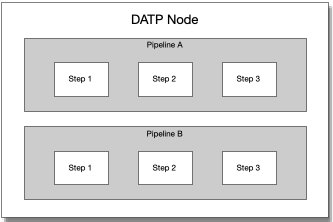
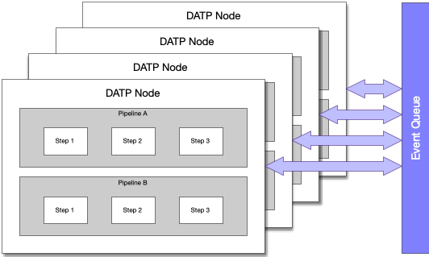
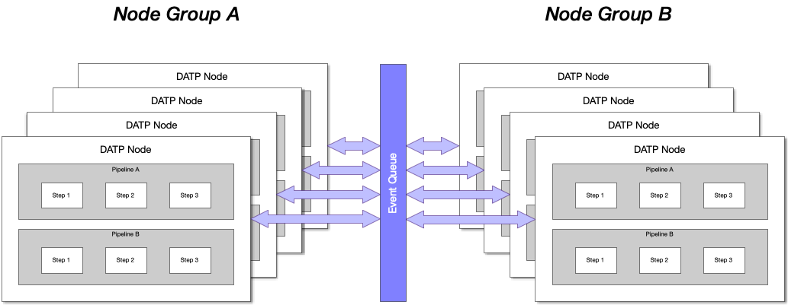
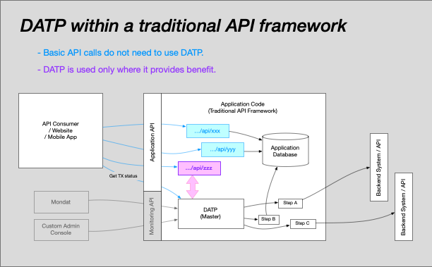
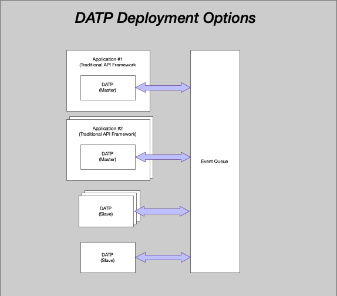

# Concepts

<!--
::: tip NOTE
Already know Vue 2 and just want to learn about what's new in Vue 3? Check out the [Migration Guide](/guide/migration/introduction.html)!
:::
-->
## Nodes

DATP is a distributed system, allowing transactions to be seamlessly run across multiple processes and servers. The lowest level of this configuration is a *node*. Within a node your application will run _transactions_. Each transaction will run a _pipeline_, and each pipeline will be composed of one or more _steps_. The steps are where you write your business logic.

<!--

-->

## Node Groups
To allow scaling, nodes can be replicated as multiple processes running across one or more machines. Each node is allocated a _nodeId_, and the collection is referenced by a _nodeGroup_ identifier that you provide. NodeIDs are allocated at the time a node starts and are not reused, so if an instance of a node is shut down and restarted it will have a new nodeId.

Communication between the nodes occurs via event queues. Some queues contain _events_ that should be consumed by a specific node, while other queues contain events that may be consumed by any node within the node group.

Each type of transaction runs a specific pipeline. It is also possible for pipelines to invoke other pipelines. The system is configured using the MONDAT console to specify which node group should be used to run a transaction.

Starting a transaction of a specific type will by default specify which node group it will run in, but it will not specify which node within the group will start the transaction.

Typically, but not always, once a transaction starts wihin a node, all the steps will be run within the same node until the transaction's pipeline completes. The exception is (a) if the pipeline starts another pipeline that is configured to run in a different node group, or (b) if the node has a failure it's workload may be shifted to another node's queue.

## Embedding DATP
So, how do I start a DATP node?

> Note: DATP is not a server framework. Rather, it is intended to be embedded _within_ an API server framework. At the time of writing, Restify is the preferred NodeJS environment, due to it's speed and maturity, and focus on providing API functionality.

DATP is intended to augment an API framework application, not to replace your API framework. For some types of transaction DATP is a valuable addition, while for others it provides little or no benefit. We leave it up to you, the application designer, to decide when the advantages provided by DATP justify the additional complexity it introduces.

A few examples...

- An API that returns a list of country codes would gain no benefit by being implemented using DATP, because a simple HTTP route accessing a database will work just fine.

- A multi-step transaction that needs to retry when there is a communication error with a backend _would_ benefit from DATP. You might want to retry until the transaction suceeds, so there's no way to know how long the transaction will take to run.

- If two teams are working on two different projects that will run within the same banking infrastructure, then security is paramount. DATP allows each team to work on different codebase, and for their code to run on different servers, but still be able to invoke each other's transactions. In other words, one team's code will never be able to hack or compromise the other teams application, because (a) they never see the other team's code, and (b) the two teams code never run on the same machine.

The following diagram shows DATP embedded in a regular API framework, and how the application's API can be mix of DATP and traditional style routes.

## Master and Slave nodes
The definition of _master_ and _slave_ is a little blurred becaause there are several ways you can embed DATP in a server, but a master node will typically provide API endpoints and be called from external systems, while a slave node does nothing other than process DATP transactions.

A master node also has the ability to provide endpoints for MONDAT or a custom admin dashboard, however whether this API is exposed will depend on how you configure you application firewall (IBM APIC, AWS Gateway, etc).
