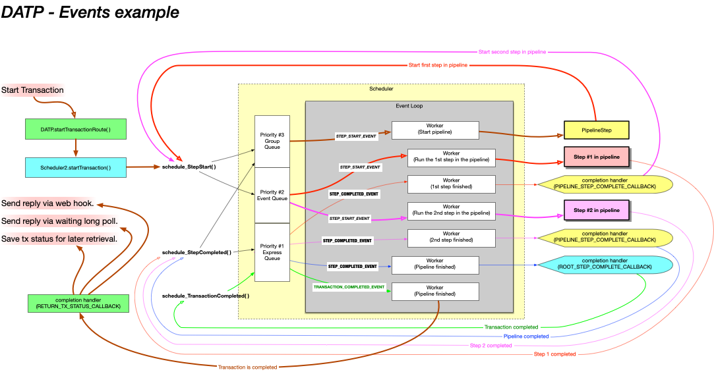
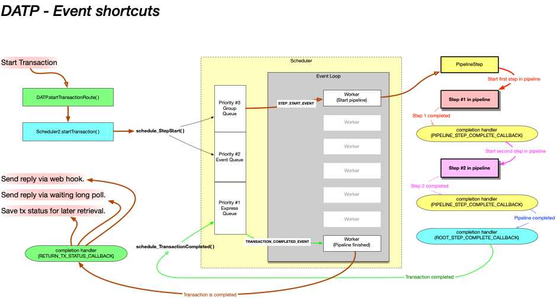

# Event Queues

## Event queues
> The following information describes the internals of DATP. If you are only developing steps that run within DATP you might like to skip this section, however it is useful if you wish to get a better understanding or you will be responsible for tuning the application.

The diagram below shows the long form of event handling used to run a pipeline containing two steps. You won't typically configure DATP to process all of these events via the queues (we explain how to shortcut in the next section) but it is neverthess useful to understand this process and the events, so you know what is being shortcut (and the potential impact).

While the diagram is a bit complicated, you'll find that if you follow the colors you can understand the flow. The transaction invokes a pipeline, which is itself a 'step'. The pipeline then invokes it's two 'child steps' one after the other, then returns.

An important thing to remember is that asynchronous transactions are _not_ like function calls - the code that starts a transaction, a pipeline, or a step cannot wait around to get the result, because it has no idea how long it will take. Instead, it provides a _completion handler_ (i.e. a callback function) that should be called to handle the result once it becomes available.

So...

- The green box on the top left that starts the transaction also provides the green transaction completion handler on the bottom left.

- The blue box that starts the pipeline on the left also provides the blue 'root step completion handler' on the right.

- The red pipeline step (that runs the two child steps) provides the 'pipeline completion handler' when it invokes it's first step. This completion handler is called when the pipeline's child steps complete, and will either call the next step in the pipeline, or complete the pipeline step.

## Worker Threads
The scheduler operates by reading events from the event queues and then passing then passing these events to _Workers_. When all the workers are occupied, it will not read further events from the queues. The number of workers is configurable by node group, and is effectively the maximum number of concurrent steps that may be run at any time.

The benefit of this approach is that you can be certain that an excessive number of API calls will not overload the system. At any time there will never be more than X events being processed (where X is the number of workers). The number of events waiting in the queues has no way to cause excessive load or botleneck the node.

The only way to determine the best number of workers for a node is to perform benchmarks, and this will be highly use case dependant. Pipelines with steps that wait on IO operations will consume a worker whilst they are waiting - in this case more workers may be required.

On the other hand, having too many workers running CPU intensive steps _will_ allow the node to be overloaded.

In extreme cases you may choose to split different pipelines into node groups with different configurations. If you need high performance, DATP provides plenty of options, but you will need to load test to determine what works best.

To improve throughput the scheduler prioritizes how it reads from queues. First it looks for events in the 'express queue', which is a node-specific queue dedicated to handling steps that have completed. Next it looks for events in the non-express node-specific queue. Last it looks for events in the group queue. The principal in each case is like letting people get out of an elevator before people try to get in. It's better for the node to finish steps and transaction that the node is already working on before it accepts something new.

## Event Shortcuts
As mentioned above DATP can be configures to byass the event queues under some circumstances. Specifically, if a step is required to be run in the same node group as the previous step, it might as well be run in the same node.

In this case we can chain together multiple steps and completion handlers, running one directly after the other.

The initial event to start the pipeline will use a queue if the pipeline needs to run in a different node group to where the transaction is being started. Similarly the final transaction-complete event must be queued back to the exact same server that started the transaction, because there might be a long poll response waiting for the result of the transaction.

There are several cases where you might want to _not_ use queue shortcutting.

- The programatic flow from Step to it's completion handler, to the next step and to it's completion handler, etc, is via standard function calls. This means that the first step might not actually return until all the pipeline steps have been invoked and returned.

- If you are debugging, it is simpler if every step is run independantly, starting from an event pulled from a queue.

- When they are chained, a bug in one step has the potential to impact other steps in the pipeline. While this risk is minimal, for especially sensitive pipelines you may wish to keep the steps separated by the event queueing.

